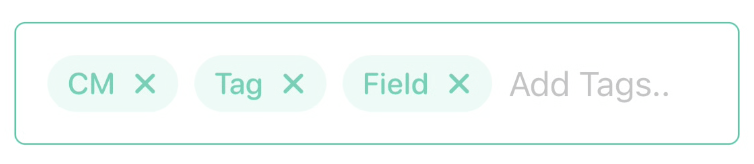

<p align="center">
  <a href="" rel="noopener">
 </a>
</p>

<h3 align="center">🏷 CMTagField 🏷</h3>

<div align="center">


</div>

---

## 📹 Preview

<p align="center">
    
</p>

## 🏁 Getting Started

### Requirements
* Xcode 11+
* SwiftUI
* iOS 14+
* macOS 10.15+

### Installaion
#### Swift Package Manager(SPM)
    File ➜ Swift Packages ➜ Add Package Dependancy..

```Swift
.package(url: "https://github.com/CM-Material/CMTagField", from: "1.0.1")
```

## 🎈Usage
```Swift
CMTagField(tags: $tags, placeholder: "Add Tags..")
CMTagField(tags: $tags, placeholder: "Add Tags..", prefix: "#")
CMTagField(tags: $tags, placeholder: "Add Tags..", prefix: "#", color: color, style: .Modern, lowercase: bool)
```
* `tags` : `Binding<String>` that stores tags data
* `placeholder`: placeholder text before add tags
* `prefix` : prefix attached to each tags
* `color` : accentColor
* `style` : `CMTagFieldStyle` ➜ `.Modern`, `.RoundedBorder`, `.Multilined`

#### 🛠Custom Modifiers
```Swift
CMTagField(tags: $tags, placeholder: "Add Tags..")
    .accentColor(color)
    .styled(CMTagFieldStyle)
    .lowercase(Bool)
```
* `.accentColor()` : Accent color
* `.styled()` : `.RoundedBorder(default)` `.Modern` `.Multilined(on progress)` support different designs
* `.lowercase` : enable force lowercase
## Example
#### 👶 Simple
```Swift
import CMTagField

struct ContentView: View {
    @State var tags: [String] = []
    
    var body: some View {
        CMTagField(tags: $tags, placeholder: "Add Tags..")
            .padding()
    }
}
```
#### Result
<p float="left">
    
    
</p>

### Styling
```Swift
import CMTagField

struct ContentView: View {
    @State var tags: [String] = []
    
    var body: some View {
        CMTagField(tags: $tags, placeholder: "Add Tags..", prefix: "#")
            .styled(.Modern)
            .accentColor(.red)
            .lowercase(true)
            .padding()
    }
}
```

### Result
<p float="left">
    
    
</p>

## ✅ TODO
- [ ] `Multilined` style

## 📜 License

CMTagField is available under the MIT license. See the `LICENSE` file for more info.

## ✍️ Author

- [🇰🇷@Changemin](https://github.com/kylelobo)
